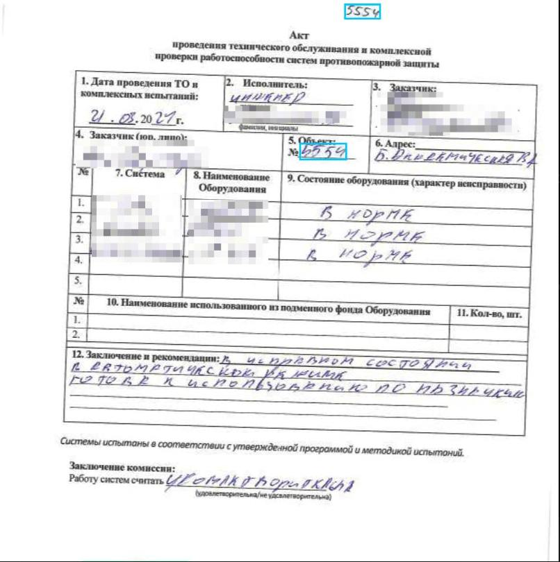

# DocsHelper
Представьте, что вам нужно отсортировать тысячи бумажных страниц по рукописным номерам. Вручную!  
Страшно? А есть компании, которые занимаются этим каждый квартал. И тратят большое количество времени.

Данный проект создан, чтобы помочь сотрудникам автоматизировать сортировку документов.

## Описание проекта

Проект представляет собой Streamlit-приложение для автоматизированной обработки и сортировки актов по номерам объектов. Приложение использует модель YOLO для обнаружения и вырезания номеров объектов с каждого акта, а затем позволяет пользователю вручную ввести обнаруженный номер. После обработки всех актов приложение сортирует их по указанным номерам и собирает в один PDF-документ.  

## Основные функции 

- **Обработка PDF-файлов:** Автоматическое разбиение PDF на отдельные страницы.  
- **Детекция номеров объектов:** Использование модели YOLO для определения областей, содержащих номера объектов, на каждой странице.  
- **Взаимодействие с пользователем:** Вывод изображений с найденными номерами для ввода соответствующего числа. Если номер написан в нескольких местах, пользователю отображаются все обнаруженные варианты.  
- **Сортировка актов:** Сбор и сортировка актов по введённым номерам.  
- **Экспорт:** Формирование нового PDF-документа, включающего все отсортированные акты. 

## Как работает приложение
ВИДЕО 

## Технологии  

- **Streamlit:** Интерфейс веб-приложения.  
- **CVAT:** Разметка датасета.
- **YOLO (Ultralytics):** Детекция номеров объектов на изображениях.  
- **PyMuPDF (fitz):** Разбиение PDF на страницы.  
- **Pandas:** Хранение и обработка данных о номерах объектов.  

## Решение для детекции номеров

Для детекции номеров была выбрана модель YOLO 11. Для её обучения был собран собственный датасет с отсканированными актами (+1500 актов) и размечен с помощью сервиса CVAT. 



Ноутбук обучения модели и результаты лежат [здесь](/notebooks)

## Установка и запуск  

1. Склонируйте репозиторий:  
   ```bash  
   git clone https://github.com/your-repository-name.git  
   cd your-repository-name  
   ```  
2. Установите зависимости:  
   ```bash  
   pip install -r requirements.txt  
   ```  
3. Запустите приложение Streamlit:  
   ```bash  
   streamlit run streamlit_app.py  
   ```  
 

## Дальнейшее развитие

- Добавление OCR для автоматического распознавания номеров объектов.  

Были опробованы предобученные OCR-модели: tesseract, EasyOCR, и дообучена TrOCR на небольшом датасете. Результаты во всех вариантах оказались неудовлетворительными. Требуется, чтобы модель безошибочно определяла номера.

Сложности:
- номера рукописные, написаны разным почерком, 
- зачастую цифры в номере записаны слитно, поэтому их не разделить на отдельные цифры для распознавания моделью, например обученной на MNIST
- не всегда хорошее качество сканов актов.

Развитие: попробовать дообучить другие ORC модели, собрать бОльший датасет.